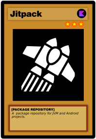
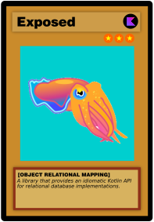
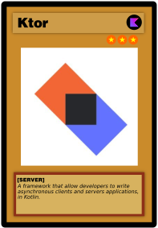
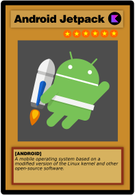
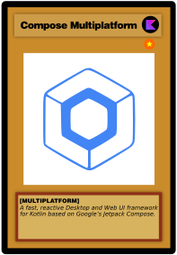

## 👋 Hi, I’m @DavidSiwarski
### ‍💻 Software Developer | 🎨 Graphic Designer

### My Accreditations / My Programming Languages
 /  
### My Scripting Languages
   
### My General Programming Tools
  
### My Kotlin Programming Tools
  
  
### My Resource Development Tools
  
  
  
  
### My Python Programming Tools
  
  

<!---
david-siwarski/david-siwarski is a ✨ special ✨ repository because its `README.md` (this file) appears on your GitHub profile.
You can click the Preview link to take a look at your changes.
--->
