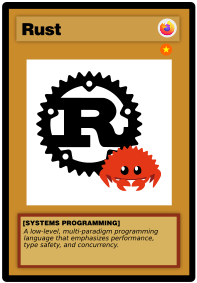
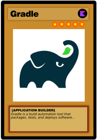
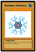

## 👋 Hi, I’m @DavidSiwarski
### 🎨 Graphic Designer |  ‍💻 Software Developer | 🌐 Network Engineer | 📊 Data Scientist

### Programming Languages 
 
### Scripting Languages
   
### General Programming Tools
  
### Kotlin Programming Tools
  
  
### Python Programming Tools
  
  
### Resource Development Tools
  
  
  
  
### Accreditations 
 

<!---
david-siwarski/david-siwarski is a ✨ special ✨ repository because its `README.md` (this file) appears on your GitHub profile.
You can click the Preview link to take a look at your changes.
--->
